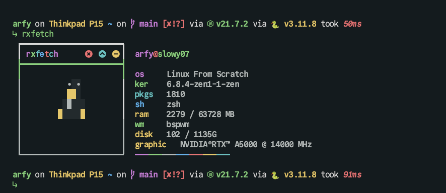

im using everblush for my current theme cause so calm and aesthetic. you can check on this [repository](https://github.com/Everblush)

## zsh

im using framework ohmyzsh for manage zsh configuration. for installation you can check [this website](https://ohmyz.sh/)

## Neovim

im using nvchad for nvim configuration, you can check on [nvchad.com](https://nvchad.com/) for installation.
after installing, you can copy and paste the configuration to ``.config/nvim``

other plugin are used
- indent blankline
- neocord
- wakatime
- markview
- triforce
- todo.nvim
- trouble
- timerly
- floatterm
- mywpm
- hlchunk
- typr
- showkeys
- minty

> this are used for daily driver and content creation

```
cp nvim ~/.config/
```
for additional plugin you can check on [`README.md`](nvim/README.md) and use default configuration for ``chadrc.lua``.


## shell prompt


im using starship for configuration prompt, you can used other one like ohmyzsh as default, powerlevel10k, or this one, but for starship i recode for device detect. for installation you can out on [starship.rs](https://starship.rs/guide/#%F0%9F%9A%80-installation)

## sysinfo



im using rxfetch for fetch all information about my sys, you can check [here](https://github.com/Mangeshrex/rxfetch)

## other

**Fonts**
its highly recommended using nerd fonts for this dots, cause many support any icon including font awesome icon. you can download and check on [nerdfonts.com](https://www.nerdfonts.com/), more information:

- Nitrogen - Wallpaper Selector


# installation

- clone this repository
```
git clone https://slowy07/my-dotfiles
```
