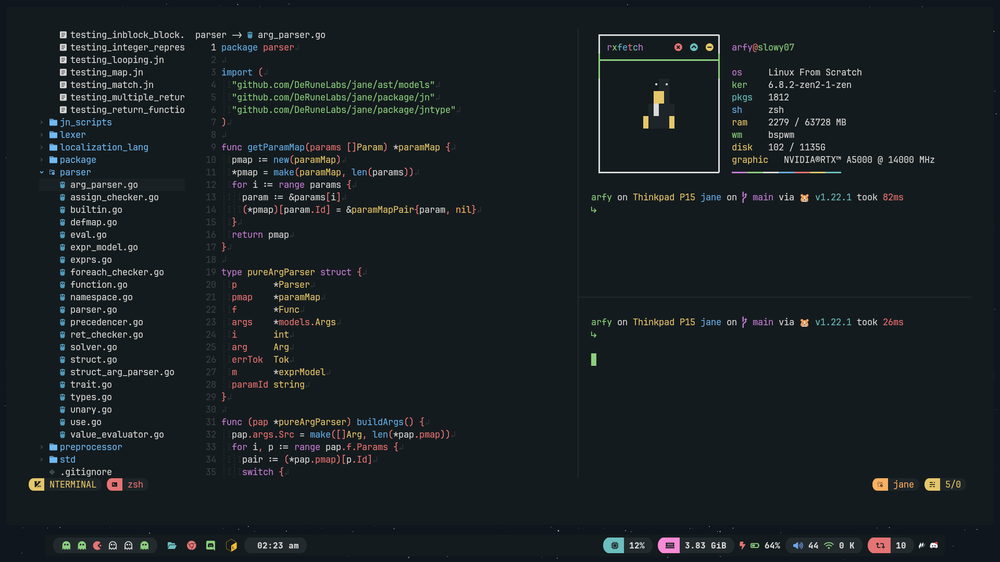

## neovim setup

my neovim setup based on nvchad, for information you can check this one

https://nvchad.com/

## additional plugins

- [neocord - discord status](https://github.com/IogaMaster/neocord)
- [barbecue - vscode winbar](https://github.com/utilyre/barbecue.nvim)
- [wakatima - record track code](https://wakatime.com/vim)
- [hlchunk - highlight indent line](https://github.com/shellRaining/hlchunk.nvim)

for ``custom/chadrc.lua`` you can use this one (cause i override a color for sync theme)

```lua
local M = {}

vim.opt.listchars = { eol = "↲" }
vim.opt.list = true

local highlights = require "custom.highlights"

M.ui = {
  theme = "everblush",
  theme_toggle = { "onedark", "one_light" },
  hl_add = highlights.add,
  statusline = {
    theme = "minimal",
    separator_style = "round",
  },
  tabufline = {
    enabled = false,
    show_numbers = true,
  },
  cmp = {
    style = "flat_dark",
  },
}

M.plugins = "custom.plugins"

M.mappings = require "custom.mappings"

return M
```
